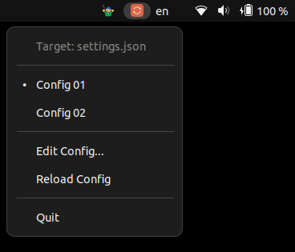

# Swap

<p align="center">
  
</p>

<div align="center">
Switch between <b>Claude Code** settings.json</b> profiles instantly.
</div>

<p align="center">
  
</p>

## Install

```bash
curl -fsSL https://raw.githubusercontent.com/alancoosta/swap/main/install.sh | bash
```

## Configuration

Edit `~/.claude/swap.json`:

```json
{
  "target": "~/.claude/settings.json",
  "profiles": {
    "Config 01": {
      "model": "opus",
      "permissions": {
        "allow": ["Bash(*)", "Read(*)", "Write(*)", "Edit(*)"],
        "deny": []
      }
    },
    "Config 02": {
      "model": "sonnet",
      "permissions": {
        "allow": ["Read(*)", "Glob(*)", "Grep(*)"],
        "deny": ["Bash(*)", "Write(*)", "Edit(*)"]
      }
    }
  }
}
```

- **target** - path to the settings file that gets overwritten
- **profiles** - named JSON objects; each one becomes a menu entry

## Features

- One-click profile switching from the system tray
- Auto-detects which profile is currently active
- Desktop notifications on profile change
- Auto-reloads when the config file changes
- Starts automatically on login

## Uninstall

```bash
curl -fsSL https://raw.githubusercontent.com/alancoosta/swap/main/install.sh | bash -s -- --uninstall
```

Your config at `~/.claude/swap.json` is preserved. Delete it manually if you no longer need it.

## Usage

```bash
swap &
```

Click the tray icon to select a profile. Each profile overwrites `~/.claude/settings.json` (or whichever target you configure).

## Requirements

- Python 3.10+
- GTK 3
- AppIndicator3 (Ayatana or legacy)
- Linux with a system tray (GNOME requires `gnome-shell-extension-appindicator`)

## License

MIT
